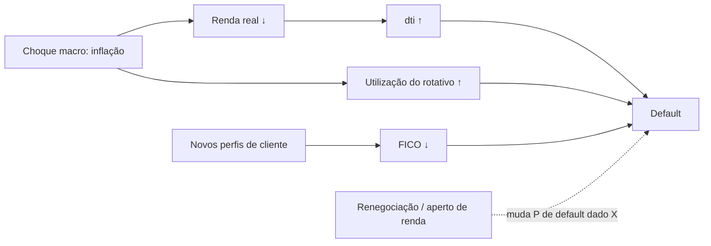

# Credit Scoring Observability

**Tech Challenge – Fase 04 | Pós-Tech em Machine Learning Engineering (FIAP)**

Projeto acadêmico de classificação binária de risco de crédito, qualidade de dados e preparação para monitoramento de modelos. A base é o **All Lending Club Loan Data**. A frente documentada aqui implementa EDA, engenharia e preparação de features, Regressão Logística baseline (V1), otimização experimental (V2), contrato de entrada com Pandera e demonstração do bloqueio de um lote inválido (*bad batch*).

> **Estado da integração:** a Etapa 1 (dados, modelo e contrato) está pronta em notebooks **e** em scripts (`make prepare`, `make train`, `make demo-contract`), com CI rodando lint e testes em dados sintéticos. As Etapas 2 (drift), 3 (observabilidade) e 4 (governança) estão em andamento.

## 1. Dataset e definição do problema

**Fonte:** [All Lending Club Loan Data, por wordsforthewise, no Kaggle](https://www.kaggle.com/datasets/wordsforthewise/lending-club).

Baixe o arquivo **`accepted_2007_to_2018Q4.csv`** e coloque-o em:

```text
data/raw/accepted_2007_to_2018Q4.csv
```

A pasta `data/` é ignorada pelo Git: nenhum CSV bruto ou gerado é distribuído diretamente neste repositório. Cada integrante deve obter sua cópia pela fonte indicada. Se o download vier compactado, extraia o `.csv` antes de rodar os notebooks (os scripts `make prepare` aceitam também o `.csv.gz`).

O arquivo de empréstimos aceitos tem aproximadamente **2.260.701 registros e 151 colunas**. A população de modelagem tem **1.348.099 empréstimos** com desfecho conhecido e usa o seguinte target:

| Classe | Desfechos incluídos |
|---|---|
| `0`: não inadimplente | `Fully Paid`; `Does not meet the credit policy. Status:Fully Paid` |
| `1`: inadimplente | `Charged Off`; `Default`; `Does not meet the credit policy. Status:Charged Off` |

`Current`, `Late`, `In Grace Period` e registros sem `loan_status` ficam fora da modelagem porque não representam desfecho final conhecido. A prevalência da classe 1 é de aproximadamente **19,98%**.

**Limitações:** trata-se de dados históricos. A análise por ano de originação (`issue_d`) deve considerar o viés de maturação: empréstimos recentes ainda abertos não entram na população rotulada. O modelo é uma prova de conceito acadêmica, não um mecanismo validado para decisão real de concessão de crédito.

## 2. Como configurar o ambiente

**Recomendado:** Python 3.11 e [`uv`](https://docs.astral.sh/uv/). Execute os comandos na raiz do repositório:

```powershell
uv sync
make setup     # pre-commit + .env a partir do .env.example (defina PSEUDONYMIZATION_SALT)
make test      # testes com dados sintéticos, sem o CSV do Kaggle
```

Reprodução da Etapa 1 por scripts, sem abrir notebook (mesmos números dos notebooks 02–04):

```powershell
make prepare        # Referência (treino) × pool de produção (teste), pseudonimizados (~25 s)
make train          # modelo V2 + threshold em models/ (~1 min)
make demo-contract  # lote corrompido bloqueado pelo contrato: exit 2 + quarentena
make help           # todos os alvos (os das Etapas 2 e 3 ainda imprimem TODO)
```

O `uv sync` utiliza `pyproject.toml` e `uv.lock`. Para notebooks no VS Code, selecione o interpretador/kernel **`.venv/Scripts/python.exe`**. Se necessário, abra a pasta `notebooks/` e confirme que `Path('../data/raw/accepted_2007_to_2018Q4.csv').exists()` retorna `True` antes da leitura.

**Importante:** o `uv.lock` versionado deve acompanhar qualquer mudança de dependências. Se o `pyproject.toml` for editado, execute `uv lock` (ou `uv sync`) e inclua ambos no commit.

## 3. Estrutura do projeto

```text
credit-scoring-observability/
├── data/                              # arquivos locais; não versionados
│   ├── raw/                           # CSV do Kaggle
│   ├── processed/                     # reference, reference_sample, production_pool (.parquet)
│   ├── production/                    # lotes mensais (Etapa 2) e o lote corrompido da demo
│   └── quarantine/                    # lotes bloqueados pelo contrato
├── models/                            # modelo (.joblib, local) e metadados/métricas (.json)
├── notebooks/                         # 01_eda … 05_data_contract
├── reports/contracts/                 # relatório JSON de cada lote validado (local)
├── src/credit_scoring_observability/
│   ├── config.py · parameters.py      # caminhos, colunas e params.yaml validado
│   ├── logger.py                      # logs estruturados, customer_id mascarado
│   ├── preprocessing.py               # população, target, features derivadas, split
│   ├── prepare.py                     # Referência × pool, pseudonimização, região
│   ├── train.py · evaluate.py         # treino da V2, métricas e seleção de threshold
│   ├── registry.py                    # load_model(): pipeline + threshold versionado
│   ├── data_contract.py · validate.py # contrato Pandera, CLI de validação, quarentena
│   └── synthetic.py                   # dados sintéticos para testes e protótipos
├── tests/                             # pytest, só com dados sintéticos
├── docs/
│   └── guias/                         # guias do projeto anterior (referência conceitual)
├── .github/workflows/ci.yml           # lint + testes
├── Makefile · params.yaml · pyproject.toml · uv.lock
```

As pastas locais sob `data/` são criadas pelos notebooks e pelos scripts conforme necessário. Os diretórios `models/` e `docs/` podem conter também arquivos criados por outras frentes do projeto.

## 4. Ordem de execução dos notebooks

Abra os notebooks **em ordem**, com o kernel do ambiente do projeto. Eles pressupõem que `../data/` aponta para a pasta local de dados.

| Notebook | Objetivo e entregável |
|---|---|
| `01_eda.ipynb` | Análise global em chunks, definição de target, nulos, auditoria de features/leakage, análise numérica, categórica e temporal. |
| `02_preprocessing.ipynb` | Transformações determinísticas, split 80/20 estratificado, pré-processador e criação de `data/reference/reference_dataset.csv` (100.000 linhas do treino, com target e `issue_date`). |
| `03_baseline_model.ipynb` | Regressão Logística V1 em amostra estratificada de 300.000 linhas do treino, avaliada no teste completo de 269.620 linhas. Gera modelo e métricas V1. |
| `04_model_optimization.ipynb` | Validação interna para comparar configuração padrão e `class_weight='balanced'`, seleção experimental de threshold por F2 condicionada à Precision mínima e avaliação final da V2. Gera modelo e metadados V2. |
| `05_data_contract.ipynb` | Valida lote correto com Pandera, cria `data/invalid/bad_batch.csv`, demonstra falhas do schema, comprova bloqueio antes da inferência e testa predições opcionais com a V2. |

**Memória:** não execute os cinco notebooks simultaneamente. O carregamento dos notebooks de treinamento foi ajustado em chunks de 25.000 linhas, com redução de tipos, porque carregar a base inteira de uma vez pode causar `MemoryError`. A V1/V2 treinam em uma amostra de 300 mil registros; o teste estratificado de cerca de 270 mil é preservado integralmente. O Reference Dataset não substitui o treino.

## 5. Modelos e métricas

Os arquivos são gerados **localmente**, na pasta `models/`:

| Artefato | Origem | Papel |
|---|---|---|
| `credit_scoring_baseline.joblib` | Notebook 03 | Pipeline completo V1 (pré-processamento + Regressão Logística). |
| `baseline_metrics.json` | Notebook 03 | Métricas V1 no teste final. |
| `credit_scoring_optimized.joblib` | Notebook 04 | Pipeline completo V2. |
| `credit_scoring_optimized_metadata.json` | Notebook 04 | Configuração escolhida, threshold, ordem das features e métricas V2. |

A V1 utiliza threshold de classificação de 0,50. Na execução registrada da V2, o threshold selecionado na validação foi **0,20**. Para reproduzir a decisão V2, **não use diretamente `pipeline.predict()`**, que segue a regra padrão do estimador. Leia `decision_threshold` dos metadados e compare com `predict_proba(X)[:, 1]`.

A comparação V1 × V2 mostrou, aproximadamente, Recall de **4,5%** na V1 e **63,5%** na V2, acompanhado de queda de Precision. ROC-AUC permaneceu perto de **0,694** e Average Precision perto de **0,357**. São resultados experimentais; os valores exatos devem ser lidos dos JSONs e gráficos gerados nos notebooks. Seleção de modelo/threshold foi feita na validação, não no teste final.

**Compartilhamento importante:** `.joblib` e `.pkl` estão no `.gitignore` e **não aparecem ao clonar o GitHub**. Para executar a inferência sem retreinar, cada colega deve receber ambos os arquivos da V2 (`credit_scoring_optimized.joblib` e `credit_scoring_optimized_metadata.json`) por um canal aprovado pelo grupo, por exemplo uma Release do repositório ou armazenamento compartilhado. O JSON de metadados sozinho **não contém o modelo**. Como alternativa, rode `make prepare && make train` (≈ 1,5 min), que reproduz a V2 com as mesmas métricas do notebook 04, ou execute os notebooks 03 e 04, usando o mesmo dataset, código e `uv.lock`. Carregue arquivos `joblib` apenas de origem confiável.

## 6. Contrato de entrada e inferência validada

O contrato fica em `src/credit_scoring_observability/data_contract.py` e valida as **23 features finais**, isto é, após `engineer_features()` e `split_features_target()`. Ele **não** recebe diretamente as 151 colunas do CSV bruto.

Valida, entre outros pontos: presença e ausência de colunas extras, empréstimo positivo, `term` em `{36, 60}`, renda não negativa/obrigatória, DTI não negativo quando presente, FICO em faixa aceita, categorias permitidas de `application_type` e coerência entre `emp_length_years == -1` e `emp_length_missing == 1`. Alguns nulos numéricos são permitidos porque o pipeline faz imputação. O contrato não aplica um teto artificial de 100% à utilização de crédito rotativo.

Depois de obter o modelo e o Reference Dataset, este é um exemplo de inferência **a partir da raiz do repositório**:

```python
from pathlib import Path
import json
import joblib
import numpy as np
import pandas as pd

from credit_scoring_observability.data_contract import (
    MODEL_FEATURES,
    predict_proba_validated,
)

batch = pd.read_csv("data/reference/reference_dataset.csv", nrows=5)
batch = batch.loc[:, MODEL_FEATURES]  # sem target e sem issue_date

model = joblib.load("models/credit_scoring_optimized.joblib")
meta = json.loads(
    Path("models/credit_scoring_optimized_metadata.json").read_text(encoding="utf-8")
)
probabilities = predict_proba_validated(model, batch)
classes = (probabilities >= float(meta["decision_threshold"])).astype(np.int8)

print(pd.DataFrame({"probabilidade_default": probabilities, "classe_v2": classes}))
```

O gate `predict_proba_validated()` valida uma cópia profunda do lote antes de invocar o modelo. Dados inválidos levantam exceção do Pandera e **não são pontuados**. Não use o conjunto de referência como se fosse um lote independente para medir performance de generalização: ele foi amostrado do treino.

## 7. Bad Batch e testes automatizados

**Script de validação operante:** `make validate BATCH=<arquivo.parquet|csv>` valida um lote; `make demo-contract` gera `data/production/corrupted.parquet` a partir do pool e o valida. Lote bloqueado sai com **exit 2**, vai para `data/quarantine/` e gera `reports/contracts/<lote>.json` com cada regra violada (camada, severidade, contagem) e exemplos com o `customer_id` mascarado. Além do contrato das features, o script aplica regras de lote: volume mínimo, cliente reenviado (`customer_id` duplicado), colunas inesperadas como `loan_status` (vazamento) e target binário.

O notebook 05 cria localmente `data/invalid/bad_batch.csv`, alterando campos como valor negativo de `loan_amnt`, prazo inválido, renda ausente, FICO fora da faixa e incoerência no indicador de tempo de emprego. Sua execução demonstra tanto as mensagens do Pandera quanto a ausência de chamada ao modelo quando a validação falha.

Na raiz do repositório:

```powershell
make test   # ou: uv run pytest -v
# testes específicos, caso necessário:
uv run pytest tests/test_data_contract.py tests/test_validate.py -v
```

Os testes usam só dados sintéticos (`synthetic.py`), então rodam no CI sem o CSV do Kaggle. O CI (`.github/workflows/ci.yml`) roda `ruff` e `pytest` em todo PR.

## 8. Como continuar

**Checklist mínimo para os próximos responsáveis:** Python/`uv` configurados (`make setup`); dataset em `data/raw/`; `make prepare && make train` executados (Referência, pool e modelo V2 com threshold); todo lote validado pelo contrato antes da inferência (`registry.load_model().score` já aplica o contrato das features); `make test` aprovado.

## 9. Governança e LGPD

Resumo do plano de proteção de dados; a versão completa, com inventário, princípios, RIPD e auditoria, está em [docs/lgpd.md](docs/lgpd.md).

**Papéis:** a fintech é a **controladora**, a plataforma de ML é a **operadora** e há um **encarregado (DPO)** nomeado (cenário fictício).

**Como a PII é tratada:**
- **Pseudonimização** no `prepare`: o `id` do empréstimo vira `customer_id` = SHA-256 de `"{sal}:{id}"`, com 16 caracteres; o sal fica no `.env`, fora do git, e o `id` original é descartado. É pseudonimização, não anonimização: o controlador consegue refazer a associação para atender o titular, então a base continua sendo dado pessoal (Art. 13, §4º).
- **Minimização:** só 27 das 151 colunas são lidas. Texto livre (`emp_title`, `title`, `desc`), CEP, `member_id` e `url` nunca são lidos; o estado vira região (4 grupos) e é descartado.
- **Sem identificador fora da base:** logs com `customer_id` mascarado por padrão, relatórios de contrato com ids mascarados (`abcd***`) e métricas só agregadas. Dados preparados ficam fora do git: região + mês + valor exato ainda deixa 6,4% dos registros únicos (k = 1).
- **Privacy by default:** a telemetria de MLflow, Evidently, GE e NannyML é desligada no `__init__.py` do pacote, antes de qualquer import.

**Base legal da decisão de crédito:** **Art. 7º, X (proteção do crédito)**, com a **Lei 12.414/2011**; Art. 7º, V para os dados da proposta; **Art. 20** para a revisão de decisão automatizada (explicação pelos coeficientes da regressão logística e revisão humana perto do threshold). O consentimento **não** é a base: seria revogável e inviabilizaria a análise de risco.

**Plano de retenção:**

| Dado | Prazo | Aplicação |
|---|---|---|
| Lotes em quarentena (bloqueados pelo contrato) | 30 dias | `make purge-quarantine` (`retention.quarantine_days`) |
| Logs (Loki) e traces (Tempo) | 90 dias | Configuração da stack (Etapa 3) |
| Métricas (Prometheus) | 90 dias | `--storage.tsdb.retention.time=90d` (Etapa 3) |
| Referência, pool e lotes | Enquanto o modelo estiver em uso + auditoria (referências legais: 5 anos, CDC Art. 43; 15 anos, Cadastro Positivo) | Fora do git; política do controlador |
| Relatórios agregados | Mantidos | Sem dados de titulares |

**Mitigação de vieses:** o Lending Club não tem idade, sexo nem raça; o atributo auditado é a **região**, proxy de raça e renda nos EUA. Ela **não é feature** do modelo e é medida com fairlearn (`make fairness`). No pool de produção, com o modelo V2:

| Região | Aprovação | FPR (bons pagadores negados) | TPR | Default observado |
|---|---|---|---|---|
| Midwest | 59,1% | 35,2% | 63,8% | 19,9% |
| Northeast | 58,6% | 35,8% | 63,4% | 20,4% |
| South | 59,6% | 34,8% | 62,2% | 20,7% |
| West | 58,5% | 36,2% | 64,1% | 18,8% |

Razão de impacto desigual **0,983** (regra dos 4/5: 0,8). A mitigação por thresholds por região com paridade de FPR foi **avaliada e não adotada**:
- os thresholds ficariam entre 0,198 e 0,203, quase iguais ao global;
- a diferença de FPR cairia de 1,4 para 0,5 p.p.;
- usar a região na decisão seria tratamento diferenciado por proxy de raça (Art. 6º, IX).

O que se adota é a região fora do modelo, a medição por lote, o guardrail no retreino (um challenger não pode piorar a razão em mais de 0,05) e a revisão humana.

## 10. Análise causal



As setas cheias mudam **quem chega** (covariate shift); a tracejada muda **o que acontece com o mesmo perfil** (concept drift). Para separar os dois, `make causal` faz uma **intervenção por grupo de variáveis ligadas**: renda + dti, rotativo e FICO. A distribuição do lote é substituída pela da Referência, preservando a ordem dentro do lote, e mede-se quanto o score e a AUC voltam ao normal.

| Sinal | Diagnóstico | Ação |
|---|---|---|
| Score muda (PSI > 0,10), AUC estável, restaurar X devolve o score | **Covariate shift** | Monitorar/recalibrar, sem retreino |
| AUC cai > 0,05 e restaurar X não recupera | **Concept drift** | Retreinar com dados recentes |

O método foi validado com o modelo V2 real: num lote com renda, dti, rotativo e FICO deslocados, restaurar os grupos recuperou 99,6% do desvio do score (84% só com renda + dti); num lote com rótulos trocados por segmento, a AUC caiu de 0,69 para 0,53 com PSI ≈ 0, e o diagnóstico foi concept drift. *Os números dos lotes M1–M7 entram com a execução de referência (Etapas 2 e 3).* **Limite:** isto mede a sensibilidade do modelo sob as hipóteses do DAG; não prova a causa no mundo real.
