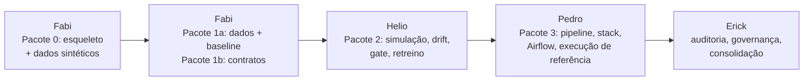

# Guias por etapa

> **Atenção:** estes guias foram escritos para o dataset Give Me Some Credit, num projeto anterior, e ficam aqui como **referência conceitual** (o porquê das decisões, as aulas e as armadilhas). Para este repositório (Lending Club), vale o que está no código e no [README](../../README.md): nomes de colunas, atributo de fairness (região, não idade) e modelo (regressão logística V2) são diferentes.

Um guia por integrante, para replicar o projeto do zero seguindo as etapas do Tech Challenge. Cada guia é **autocontido**: dá para colar o arquivo inteiro numa LLM (Claude, Gemini, GPT...) como contexto e trabalhar a partir dele.

| Ordem | Etapa | Responsável | Guia |
|---|---|---|---|
| 1º | Validação de Dados e Contratos (+ esqueleto do projeto) | Fabi | [etapa-1-validacao-fabi.md](etapa-1-validacao-fabi.md) |
| 2º | Simulação e Detecção de Drift | Helio | [etapa-2-drift-helio.md](etapa-2-drift-helio.md) |
| 3º | Observabilidade de Pipelines e Modelos | Pedro | [etapa-3-observabilidade-pedro.md](etapa-3-observabilidade-pedro.md) |
| 4º | Governança (Privacy by Design e by Default) e fechamento | Erick | [etapa-4-governanca-erick.md](etapa-4-governanca-erick.md) |

O vídeo STAR não está nestes guias.

## Começando do zero

O grupo vai construir o projeto de novo, num **repositório novo**, com o objetivo de **cumprir o que o enunciado pede** e chegar a um resultado parecido com o do projeto anterior.

- **Repositório novo:** a Fabi cria no dia 1 (Pacote 0) e copia esta pasta `docs/guias/` para lá. O projeto anterior fica só como **referência para consulta** (privado: o Erick adiciona os colegas como colaboradores): https://github.com/eeyamazaki/credit-scoring-sustentacao
- **Núcleo primeiro.** Cada guia tem a seção **"2.1 Prioridade"**, que separa o que o enunciado exige (núcleo) do que é diferencial (extras). Ninguém começa um extra antes de o núcleo da sua etapa estar pronto e no CI.
- **Linha de corte no fim da semana 3.** Extra que não estiver funcionando com teste até a execução de referência é cortado e vira uma linha no README ("avaliado, fora do escopo"). O núcleo nunca é cortado.
- **Resultado parecido, não idêntico.** As tabelas de números dos guias são do projeto anterior. O que precisa se repetir é o **comportamento**: o contrato barra o lote ruim; o covariate shift aparece no PSI sem derrubar a AUC; o concept drift derruba a AUC com PSI baixo; os alertas disparam; a governança explica tudo isso.

## Fluxo de trabalho: revezamento com sobreposição



Três regras mantêm o fluxo sem interrupções:

1. **Ninguém depende de quem vem depois.** Tudo o que alguém precisaria "de trás" já está decidido nos guias (seção "Decisões já tomadas"). Quem recebe o bastão trabalha só com o pacote recebido e com essas decisões.
2. **Ninguém fica parado esperando.** Antes do bastão, cada um adianta a sua parte com os dados sintéticos do Pacote 0 e com stubs das interfaces. Depois de entregar, cada um documenta o que construiu.
3. **Os números são congelados uma vez só**, na execução de referência do fim da semana 3. Toda a documentação da semana 4 usa esses números.

| Semana | Com o bastão | Recebe | Entrega | Os outros, sem esperar |
|---|---|---|---|---|
| 1 | **Fabi** | nada | **Pacote 0** (dia 1–2): esqueleto + dados sintéticos · **1a** (dia 3): dados + baseline · **1b** (fim): contratos | Helio: `stats.py` e simulador com sintéticos; calibração a partir do 1a · Pedro: stack com métricas falsas · Erick: rascunho do `lgpd.md` |
| 2 | **Helio** | Pacote 1 | **Pacote 2:** lotes M1–M7, drift, performance, gate, retreino, `fairness_by_age` | Fabi: model card e runbooks de dados · Pedro: estágios com stubs, alertas, dashboard, Airflow · Erick: `causal.py` e `retention.py` com sintéticos |
| 3 | **Pedro** | Pacotes 1 e 2 | **Pacote 3:** pipeline integrado, stack, Airflow + **execução de referência** (números congelados) | Helio: política de retreino, ADRs, runbooks de drift/modelo, linha do tempo · Erick: fairness, mitigação e causal com dado real |
| 4 | **Erick** | Pacotes 1, 2 e 3 + a documentação de cada um | auditoria de privacidade, `lgpd.md`, post-mortem, `monitoring-plan.md` consolidado, README | Pedro: catálogo de métricas e runbooks de pipeline/infra · todos: revisão cruzada |

## Regras do bastão

1. **O pacote só passa com o checklist da etapa completo** (seção "Checklist de pronto" de cada guia) e o CI verde na `main`.
2. **Passagem com demonstração de 30 minutos:** quem entrega roda os comandos do pacote na frente de quem recebe.
3. **Cada passagem tem uma tag git:** `pacote-0`, `pacote-1a`, `pacote-1b`, `pacote-2`, `pacote-3`, `execucao-referencia`.
4. **Depois de entregar, a pessoa só corrige o próprio pacote.** Pedido de mudança de interface vira um PR pequeno.
5. **Quem adianta trabalho** usa os dados sintéticos (`tests/conftest.py`) e as interfaces da seção "Contratos entre as etapas". Na chegada do pacote real, só troca a fonte de dados.

## Regras do repositório (valem para todos)

- **Commits semânticos** (requisito do enunciado), no padrão Conventional Commits: `feat(contracts): ...`, `fix(pipeline): ...`, `docs: ...`, `test: ...`, `ci: ...`, `build: ...`. Um assunto por commit.
- **PRs pequenos direto na `main`**, com o CI verde. Nada de branch parada por uma semana.
- **Dono de cada arquivo compartilhado** (os outros pedem a mudança no PR):

  | Arquivo | Dono |
  |---|---|
  | `pyproject.toml`, `uv.lock`, `src/config.py`, `src/parameters.py`, `src/__init__.py` | Fabi |
  | `params.yaml` | cada um a sua seção: `split`/`train`/`contract` (Fabi), `simulation`/`drift`/`performance`/`retrain` (Helio), `retention` (Erick) |
  | `Makefile`, `docker-compose.yml`, `.github/workflows/`, `src/logger.py` | Pedro (a Fabi cria a primeira versão no Pacote 0) |
  | `README.md` | Erick (cada um propõe a seção da sua etapa) |

- **Formato dos runbooks** (cada dono escreve os da sua parte; o Erick junta no `docs/monitoring-plan.md`):

  ```markdown
  ### NomeDoAlerta
  - **Significa:** o que disparou, em uma frase.
  - **Investigar:** onde olhar (relatório, painel do Grafana, consulta no Loki, trace).
  - **Ação:** o que fazer, e o que NÃO fazer.
  ```

  O título precisa ser o nome exato do alerta: o `runbook_url` das regras aponta para essa âncora.

## Mapa de cobertura dos requisitos

| Requisito do enunciado | Quem entrega |
|---|---|
| Classificador base treinado na Referência | Fabi |
| Contrato de dados (GE/Pandera) com ≥ 3 regras rígidas | Fabi |
| Lote com erros bloqueando a ingestão; "script de validação operante" | Fabi (CLI de validação + lote corrompido) |
| Separação Referência × Produção | Fabi |
| Dataset de produção com ≥ 2 variáveis alteradas + predições | Helio |
| Evidently comparando Referência × Produção; PSI/KS apontando as features | Helio |
| Logs e métricas centralizados; MLflow e dashboard | Pedro |
| Métricas de saúde documentadas | Pedro (catálogo) + Erick (plano consolidado) |
| Alertas de degradação e estabilidade da infraestrutura | Pedro |
| Governança LGPD no README: PII, base legal, retenção | Erick |
| Mitigação de vieses | Helio (guardrail) + Erick (análise e mitigação) |
| Análise causal | Erick |
| Commits semânticos | todos |

## Como usar com uma LLM

1. Abra uma conversa nova e cole o guia inteiro.
2. Peça uma tarefa por vez, na ordem da seção "Passo a passo" do guia.
3. Cole de volta os erros e as saídas reais. Não aceite números que a LLM "estimou": rode e confira.
4. Se a LLM propuser algo que contradiz uma decisão da seção "Decisões já tomadas", mantenha a decisão ou leve a mudança para o grupo.

A implementação completa está neste repositório. Cada guia aponta os arquivos de referência para comparar o seu código.
