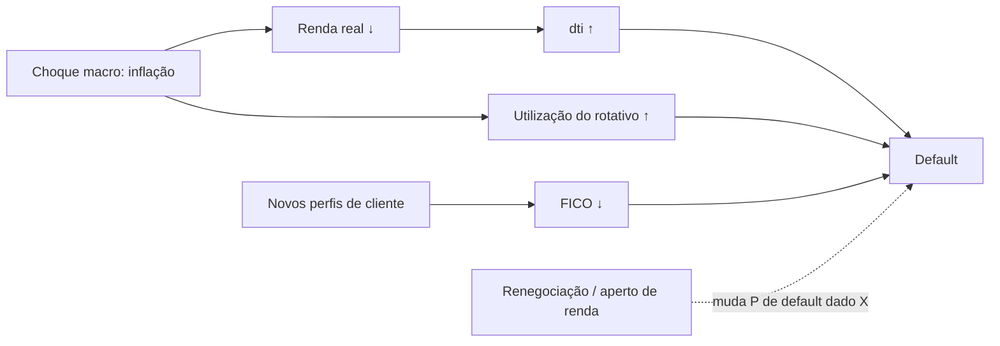

# Governança e proteção de dados (LGPD)

Plano de proteção de dados do modelo de crédito: quais dados pessoais existem, com que base legal são tratados, como são protegidos, por quanto tempo são guardados, como o viés é controlado e o que causa o drift. A versão resumida está no [README](../README.md#9-governança-e-lgpd).

> **Cenário.** Uma fintech brasileira (fictícia) usa o modelo para conceder crédito pessoal. O dataset é o público do Lending Club (EUA, Kaggle), sem nomes nem documentos, mas com campos que identificam indiretamente (cargo em texto livre, CEP parcial, estado). Os lotes de "produção" são **dados sintéticos baseados em regras**, derivados do pool de teste (Etapa 2). As decisões abaixo são as que valeriam num tratamento real.

> **Estado do documento.** Os itens 1–7 e 9 estão completos. Os números dos itens 8 e 10 são da execução de 2026-10-03 (modelo V2 no pool de produção) e serão alinhados à **execução de referência** (tag `execucao-referencia`) quando a Etapa 3 congelar os números. O item 11 (auditoria) registra o que já foi verificado e o que depende das Etapas 2 e 3.

## 1. Papéis

| Papel (LGPD Art. 5º) | Quem, no cenário | Responsabilidade neste projeto |
|---|---|---|
| **Controlador** | A fintech de crédito | Decide a finalidade (concessão de crédito) e responde pelo tratamento |
| **Operador** | Plataforma de ML (este pipeline) | Trata os dados em nome do controlador, nos limites da finalidade |
| **Encarregado (DPO)** | Encarregado nomeado pela fintech | Canal com titulares e ANPD; revisa o RIPD, as trocas de modelo e os alertas de fairness |

Um modelo de crédito toma decisões automatizadas sobre todos os clientes. O caso Telekall (Aula 3 de Privacidade), em que a ausência de encarregado agravou a sanção, mostra por que o encarregado precisa existir e participar das trocas de modelo.

## 2. Inventário de dados

O arquivo bruto tem 151 colunas; o `prepare` lê **27** (`preprocessing.BASELINE_FEATURES` + `loan_status`, `issue_d`, `id`, `addr_state`):

| Classe | Colunas | Pessoal? | Tratamento |
|---|---|---|---|
| Identificador direto | `id`, `member_id`, `url` (contém o id) | Sim | `id` → `customer_id` pseudonimizado (item 2.1) e descartado; `member_id` e `url` **não são lidos** |
| Texto livre | `emp_title`, `title`, `desc` | Sim, e pode revelar terceiros ou saúde | **Não são lidos** (minimização) |
| Localização | `zip_code` (3 dígitos), `addr_state` | Quase-identificador | CEP **não é lido**; estado → **região do Census** (4 grupos), guardada só para auditoria de viés; o estado é descartado no `prepare` |
| Financeiros e de crédito | renda, dti, FICO, rotativo, atrasos, contas, consultas, tempo de emprego, finalidade, moradia | Sim | 23 features do modelo (`data_contract.MODEL_FEATURES`) |
| Condições do empréstimo | valor, prazo, data de emissão | Sim | Valor e prazo são features; a data (mês) ordena os lotes |
| Desfecho | `loan_status` | Sim | Vira o `target` e é descartado |
| Pós-desfecho e juros | pagamentos, recuperação, FICO final, `int_rate`, `grade` | Sim | **Não são lidos** (vazamento de rótulo e minimização; auditoria do notebook 01) |

**Não há dados sensíveis do Art. 11** (origem racial, religião, saúde, biometria, vida sexual...) nem sexo ou idade. A localização, porém, é **proxy** de raça e renda nos EUA (*redlining*); por isso a região é auditada (item 8) e nunca entra no modelo.

### 2.1 Anonimização × pseudonimização

- **Anonimização** (Art. 12): o dado não pode mais ser associado ao titular por meios razoáveis. Dado anonimizado deixa de ser dado pessoal.
- **Pseudonimização** (Art. 13, §4º): o dado só é associado ao titular com uma informação adicional mantida separadamente.

O `customer_id` é **pseudonimizado** (`prepare.pseudonymize`): SHA-256 de `"{sal}:{id}"` com um **sal secreto** (`PSEUDONYMIZATION_SALT` no `.env`, fora do git), truncado em 16 caracteres. Sem o sal, reverter exige força bruta; com o sal, basta recalcular o hash. Por isso a base continua sendo **dado pessoal**: o controlador consegue refazer a associação, e precisa conseguir, para atender os direitos do titular (item 6).

### 2.2 Risco de reidentificação (k-anonimato)

Um registro com k = 1 é único para aquela combinação de quase-identificadores. População de modelagem (1.348.099 empréstimos), com o que os parquet guardam:

| Quase-identificadores | Registros únicos (k = 1) | k < 5 |
|---|---|---|
| região + mês + valor exato | **6,4%** | 17,2% |
| região + mês + faixa de US$ 5 mil | 0,0% | 0,0% |
| região + mês + valor + renda | 54,8% | 79,9% |
| região + mês + valor + renda + FICO | 89,2% | 99,6% |

Consequências: mesmo sem nome nem documento, quem conhece valor, mês e renda de um cliente acha o registro. Por isso:
- CEP e estado saem do pipeline;
- Referência, pool e lotes ficam restritos ao time de modelagem, **fora do repositório** (`data/` no `.gitignore`);
- logs, métricas e relatórios **não carregam linhas**, só agregados e ids mascarados.

## 3. Base legal

| Tratamento | Base legal |
|---|---|
| Análise de risco para concessão de crédito | **Art. 7º, X — proteção do crédito**, complementada pela **Lei 12.414/2011** (Cadastro Positivo) |
| Uso dos dados informados na proposta | **Art. 7º, V — procedimentos preliminares de contrato**, a pedido do titular |
| Monitoramento, retreino e auditoria do modelo | Mesma finalidade (proteção do crédito): o retreino é tratamento **compatível** com a finalidade original, registrado no RIPD |
| Auditoria de viés por região | **Art. 6º, IX (não discriminação)** e **Art. 20, §2º** (auditoria de aspectos discriminatórios em decisão automatizada). A região serve só para medir, nunca para decidir |
| Decisão automatizada de crédito | **Art. 20**: o titular pode pedir revisão (item 6) |

O consentimento **não** é a base legal: ele poderia ser revogado a qualquer momento, o que inviabilizaria a análise de risco que a própria lei de proteção do crédito prevê.

Uso do dataset: dados públicos do Kaggle; o arquivo não é redistribuído pelo repositório, e cada integrante baixa a própria cópia.

## 4. Os 10 princípios da LGPD (Art. 6º) no projeto

| Princípio | Decisão concreta |
|---|---|
| **Finalidade** | Dados usados só para risco de crédito; o pipeline não exporta perfis para outros usos |
| **Adequação** | Features ligadas ao comportamento de crédito e às condições do empréstimo, conhecidas na concessão |
| **Necessidade** (minimização) | 27 das 151 colunas lidas; texto livre, CEP, `member_id` e `url` nunca lidos; estado reduzido a região; `customer_id` fora do modelo |
| **Livre acesso** | O titular pode consultar os dados e o score (item 6) |
| **Qualidade dos dados** | Contrato Pandera + regras de lote; lote inválido vai para a quarentena e não é pontuado (`make demo-contract`) |
| **Transparência** | Model card, coeficientes da regressão logística, notebooks de estudo, handoffs, este documento |
| **Segurança** | Sal fora do repositório; dados fora do git; logs e relatórios sem identificadores |
| **Prevenção** | Monitoramento de drift e performance evita decisões erradas em série (degradação silenciosa) |
| **Não discriminação** | Região fora do modelo; aprovação por região medida, com alerta e **guardrail** de promoção (item 8) |
| **Responsabilização e prestação de contas** | Commits semânticos, relatórios de contrato/fairness/causal, runs do MLflow (Etapa 3), post-mortem |

## 5. Privacy by Design (7 princípios de Cavoukian)

| Princípio | Como aparece |
|---|---|
| Proativo, não reativo | O contrato bloqueia o dado ruim **antes** do score; o drift é detectado antes de o rótulo chegar |
| Privacidade como padrão | Logs mascaram identificadores por padrão (`logger.redact_identifiers`); telemetria de terceiros (MLflow, Evidently, GE, NannyML) **desligada por padrão** em `src/credit_scoring_observability/__init__.py`; colunas de texto livre fora da lista de leitura |
| Privacidade embutida no design | Pseudonimização e generalização (estado → região) na primeira etapa (`prepare`), antes de qualquer outro processamento |
| Funcionalidade total (soma positiva) | Monitoramento completo, inclusive fairness, sem identificadores em claro: as métricas são agregados por lote |
| Segurança ponta a ponta | Quarentena com prazo e descarte (`make purge-quarantine`); retenção de 90 dias em configuração na stack (Etapa 3) |
| Visibilidade e transparência | Contratos, parâmetros, decisões, relatórios e notebooks versionados |
| Respeito ao titular | Direitos do item 6 atendíveis com a pseudonimização reversível pelo controlador |

## 6. Direitos do titular (Art. 18 e 20)

| Direito | Como é atendido |
|---|---|
| Confirmação e acesso | O controlador recalcula o hash com o sal e localiza o registro e o score |
| Correção | Correção na origem; o próximo lote passa pelo contrato com o dado corrigido |
| Anonimização, bloqueio ou eliminação | Eliminação na origem e nos lotes retidos; métricas e relatórios agregados não contêm o titular |
| Informação sobre compartilhamento | Não há compartilhamento no escopo do pipeline |
| **Revisão de decisão automatizada (Art. 20)** | Explicação pelos termos de maior contribuição da regressão logística (coeficientes do pipeline); **revisão humana** na faixa próxima do threshold (0,20) e sob pedido do titular |

## 7. Retenção e descarte

| Dado | Prazo | Como é aplicado |
|---|---|---|
| Arquivo bruto do Kaggle | Não é redistribuído | Cada integrante baixa; fora do git |
| Referência e pool (`data/processed/`) | Enquanto o modelo treinado neles estiver em uso + auditoria | Política do controlador; fora do git |
| Lotes de produção | Enquanto usados em treino ou auditoria. Referências legais: 5 anos para informação negativa (CDC Art. 43, §1º) e 15 anos para o histórico do Cadastro Positivo (Lei 12.414/2011) | Política do controlador |
| **Quarentena** (lotes bloqueados) | **30 dias** (`retention.quarantine_days`) | `make purge-quarantine` (`retention.py`, com `--dry-run`) apaga o lote; o relatório do contrato fica (agregado, ids mascarados) |
| **Logs** (Loki) e **traces** (Tempo) | **90 dias** | `retention_period: 2160h` e `block_retention: 2160h` na configuração da stack (Etapa 3) |
| Métricas (Prometheus) | **90 dias** | `--storage.tsdb.retention.time=90d` (Etapa 3) |
| Relatórios agregados, decisões, runs do MLflow | Mantidos | Não contêm dados de titulares, só agregados |

**Sanções** (Art. 52): advertência; multa de até 2% do faturamento no Brasil, limitada a R$ 50 milhões por infração; publicização da infração; bloqueio ou eliminação dos dados.

## 8. Viés e fairness

O atributo auditado é a **região** do cliente (Census dos EUA: Northeast, Midwest, South, West), derivada do estado (`fairness.py`, fairlearn `MetricFrame`). A decisão é "negar" quando o score passa do threshold (0,20).

### Situação do modelo V2 (pool de produção, 269.620 empréstimos; `make fairness`)

| Região | Empréstimos | Aprovação | TPR (inadimplentes negados) | FPR (bons pagadores negados) | Default observado |
|---|---|---|---|---|---|
| Midwest | 47.209 | 59,1% | 63,8% | 35,2% | 19,9% |
| Northeast | 54.484 | 58,6% | 63,4% | 35,8% | 20,4% |
| South | 95.583 | 59,6% | 62,2% | 34,8% | 20,7% |
| West | 72.344 | 58,5% | 64,1% | 36,2% | 18,8% |

**Razão de impacto desigual: 0,983** (regra dos 4/5: 0,8); diferença máxima de FPR entre regiões: 1,5 p.p. Não há disparidade relevante entre regiões.

### Em produção (Etapa 2)

A razão por região é medida em cada lote (`approval_disparity`, sem precisar de rótulo) e entra como **guardrail** do retreino: um challenger não é promovido se piorar a razão em mais de 0,05. *Tabela por lote a preencher com a execução de referência.*

### Mitigação avaliada e não adotada (`mitigation.py`)

Thresholds por região com **paridade de FPR**, determinísticos: a meta é o FPR global do threshold atual (35,5%), e o threshold de cada região é o quantil (1 − meta) do score dos seus bons pagadores. A estimativa é feita numa metade do pool e a avaliação na outra:

| | Aprovação | Default entre aprovados | Impacto desigual | Diferença de FPR |
|---|---|---|---|---|
| Threshold único (0,20) | 59,1% | 12,5% | 0,980 | 1,4 p.p. |
| Por região (0,198–0,203) | 59,2% | 12,5% | 0,984 | 0,5 p.p. |

**Decisão: não adotar** (`adopted_in_production: false`).
1. O ganho é desprezível: os thresholds por região ficariam quase iguais ao global.
2. Usar a região explicitamente na decisão é **tratamento diferenciado por um proxy de raça**, mais difícil de justificar (Art. 6º, IX) do que um modelo que não a usa. A adoção dependeria de avaliação jurídica.
3. O `ThresholdOptimizer` do fairlearn foi descartado: ele sorteia a decisão dentro do grupo, o que é indefensável diante do pedido de revisão do Art. 20.

O que se adota é a **fairness through unawareness** no modelo (a região não é feature), a vigilância por lote, o guardrail no retreino e a revisão humana perto do threshold.

## 9. Relatório de Impacto (resumo de RIPD, Art. 38)

| Risco | Probabilidade | Impacto | Medida |
|---|---|---|---|
| Decisão errada em série por degradação silenciosa do modelo | Alta (a economia muda) | Alto | Drift + performance + gate (Etapa 2); retreino com guardrails; alertas (Etapa 3) |
| Discriminação indireta por localização | Baixa entre regiões (0,983) | Alto | Localização fora do modelo; medição por lote; guardrail; revisão humana |
| Dado corrompido pontuado | Média | Alto | Contrato + regras de lote; quarentena; exit 2 no pipeline |
| Reidentificação por quase-identificadores | Média (6,4% únicos com região + mês + valor) | Alto | CEP e estado fora; dados fora do git e restritos; nenhum dado de linha em logs, métricas e relatórios |
| Reidentificação a partir de logs/relatórios | Baixa | Alto | Pseudonimização com sal; mascaramento em logs e relatórios; teste automatizado de ausência de id (Etapa 3) |
| Vazamento do sal | Baixa | Alto | `.env` fora do git; trocar o sal invalida a associação |
| Texto livre com dados de terceiros ou de saúde | Alta se lido | Alto | `emp_title`, `title` e `desc` nunca lidos |
| Retenção excessiva | Média | Médio | Quarentena 30 dias com descarte; logs/traces/métricas 90 dias em configuração |
| Uso para outra finalidade no retreino | Baixa | Médio | Retreino só com lotes aprovados no contrato, mesma finalidade |
| Telemetria de bibliotecas enviando metadados a terceiros | Média (padrão das libs) | Baixo | Opt-out centralizado no `__init__.py` do pacote |

## 10. Análise causal do problema

A pergunta da diretoria — "o modelo está tomando decisões erradas por causa da economia?" — tem respostas diferentes em cada momento. O projeto separa **quem chega** (covariate shift) de **o que acontece com o mesmo perfil** (concept drift).

### DAG de hipóteses

As setas cheias mudam **quem** chega (covariate shift). A tracejada muda **o que acontece** com o mesmo perfil (concept drift). As hipóteses são do grupo; o DAG não foi aprendido dos dados.

### Atribuição por intervenção (`causal.py`, `make causal`)

Para cada grupo de variáveis causalmente ligadas — **renda + dti** (o dti é a dívida dividida pela renda), **rotativo** (`revol_util`, `revol_bal`) e **score (FICO)** —, a distribuição do lote é substituída pela da Referência. O mapeamento é por quantis e **preserva a ordem** dentro do lote, para não quebrar as correlações do grupo (Aula 4 de Drift). Em seguida, mede-se quanto o efeito no modelo (PSI do score, aprovação, AUC) volta ao normal, em todas as combinações de grupos, com o modelo que estava em produção durante o drift.

Diagnóstico automático:
- **Covariate shift:** PSI do score > 0,10, AUC estável, e restaurar X devolve o score.
- **Concept drift:** AUC cai > 0,05, e restaurar X **não** recupera a AUC, porque P(Y|X) mudou.

*Tabelas por lote (M4, M6) a preencher com `make causal` sobre os lotes da Etapa 2 na execução de referência.* O método já foi validado com o modelo V2 real em lotes de teste montados a partir do pool:
- **lote estável:** "sem drift";
- **lote com renda, dti, rotativo e FICO deslocados:** restaurar os três grupos recuperou 99,6% do desvio do score; só renda+dti, 84%;
- **lote com rótulos trocados por segmento:** AUC de 0,69 para 0,53 com PSI ≈ 0 e diagnóstico de concept drift.

**Limite do método:** isto mede a **sensibilidade do modelo** a cada grupo sob as hipóteses do DAG. Não prova a causa no mundo real; para isso seriam necessários dados de intervenção (uma política de crédito alterada para um grupo de controle, por exemplo) ou um desenho quase-experimental.

## 11. Auditoria de privacidade

| Verificação | Responsável | Estado | Evidência |
|---|---|---|---|
| Sal de pseudonimização fora do git | Etapa 1 | ✅ | `.env` no `.gitignore`; `prepare` avisa se o sal padrão estiver em uso; `prepare_report.json` registra `default_salt_used` |
| `id` original descartado; `customer_id` determinístico e salgado | Etapa 1 | ✅ | `tests/test_prepare.py` (pseudonimização, colunas de saída) |
| Estado e CEP fora dos dados preparados | Etapa 1 | ✅ | `tests/test_prepare.py::test_outputs_have_the_shared_schema` |
| `customer_id` mascarado nos relatórios de contrato | Etapa 1 | ✅ | `tests/test_validate.py::test_examples_are_masked`, `test_enforce_quarantines_and_raises` |
| Logs mascaram identificadores antes de gravar | Etapa 1 | ✅ | `tests/test_logger.py` |
| Telemetria das bibliotecas desligada antes do import | Etapa 1 | ✅ | `src/credit_scoring_observability/__init__.py` |
| Quarentena com descarte em 30 dias | Etapa 4 | ✅ | `retention.py`, `tests/test_governance.py::test_purge_removes_only_expired` |
| Nenhum `customer_id` em logs do pipeline, métricas e spans (ponta a ponta) | Etapa 3 | ⏳ | Teste automatizado previsto no Pacote 3 |
| Retenção de 90 dias na configuração de Loki, Tempo e Prometheus | Etapa 3 | ⏳ | Configuração da stack |
| Fairness por região como guardrail do retreino | Etapa 2 | ⏳ | Retreino (extra) |
